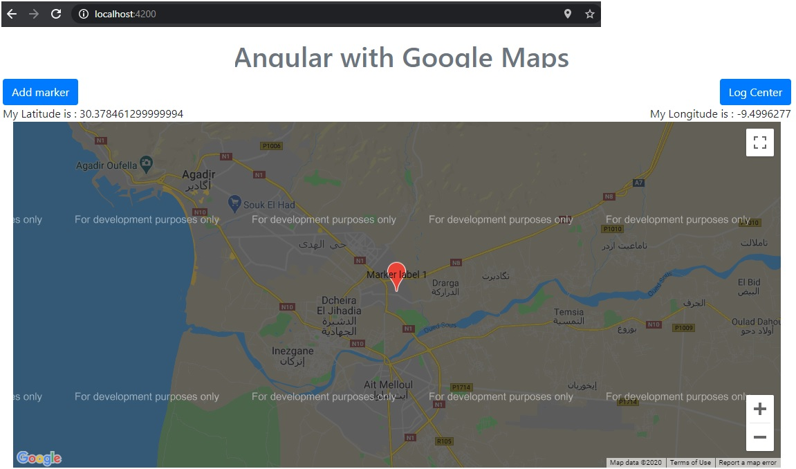

<h1>Google Maps is now an Angular component</h1>

  This project shows you how to use Google maps with Angular, and print the map with the user's current position.

  In this post, we take a look at getting started with the Google Maps component. To install GoogleMaps in Angular tap : npm install @angular/google-maps.
  And When the installation is finished, we must add the Angular module GoogleMapsModule to the import declaration (see app.module.ts).

<h3>The GoogleMapsModule exports three components that we can use:</h3>
<ul>
  <li>GoogleMap: this is the wrapper around Google Maps, available via the google-map selector</li>
  <li>MapMarker: used to add markers on the map, available via the map-marker selector</li>
  <li>MapInfoWindow: the info window of a marker, available via the map-info-window selector</li>
</ul>

<h3>Loading the Maps JavaScript API : </h3>

We also have to import the Maps API, this can be done by adding a script tag in the index.html file :   
    

    To use the map you will need to create a new API Key, follow the documentation ( https://developers.google.com/maps/documentation/javascript/get-api-key )
    to create a new key.

<h3>The result of this project is : </h3>

# AngularGoogleMaps

This project was generated with [Angular CLI](https://github.com/angular/angular-cli) version 9.1.13.

## Development server

Run `ng serve` for a dev server. Navigate to `http://localhost:4200/`. The app will automatically reload if you change any of the source files.

## Code scaffolding

Run `ng generate component component-name` to generate a new component. You can also use `ng generate directive|pipe|service|class|guard|interface|enum|module`.

## Build

Run `ng build` to build the project. The build artifacts will be stored in the `dist/` directory. Use the `--prod` flag for a production build.

## Running unit tests

Run `ng test` to execute the unit tests via [Karma](https://karma-runner.github.io).

## Running end-to-end tests

Run `ng e2e` to execute the end-to-end tests via [Protractor](http://www.protractortest.org/).

## Further help

To get more help on the Angular CLI use `ng help` or go check out the [Angular CLI README](https://github.com/angular/angular-cli/blob/master/README.md).
