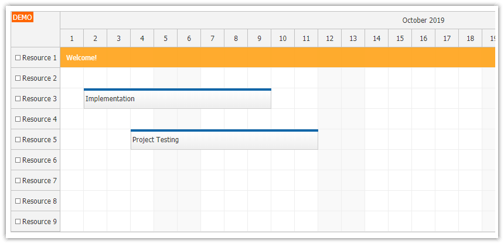

<h1>Angular Scheduler UI with Spring Boot Backend (Java)</h1>

    Angular project that shows how to create Scheduler UI using DayPilot Pro for Angular. Includes a backend REST/JSON application implemented using Spring Boot (Java).

<h3>Technologies used :</h3>
<ul>
    <li>Angular 9</li>
    <li>DayPilot ( npm install https://npm.daypilot.org/daypilot-pro-angular/trial/2020.4.4807.tar.gz --save )</li>
    <li>Java 8</li>
    <li>Spring Boot 2.4.1</li>
    <li>Maven 4.0.0 </li>
    <li>Mysql</li>
</ul>

The Backend for this project : https://github.com/bouguern/springBoot-angular-projects/tree/master/Spring/schedulerSpringBoot 

# SchedulerApp

This project was generated with [Angular CLI](https://github.com/angular/angular-cli) version 9.1.13.

## Development server

Run `ng serve` for a dev server. Navigate to `http://localhost:4200/`. The app will automatically reload if you change any of the source files.

## Code scaffolding

Run `ng generate component component-name` to generate a new component. You can also use `ng generate directive|pipe|service|class|guard|interface|enum|module`.

## Build

Run `ng build` to build the project. The build artifacts will be stored in the `dist/` directory. Use the `--prod` flag for a production build.

## Running unit tests

Run `ng test` to execute the unit tests via [Karma](https://karma-runner.github.io).

## Running end-to-end tests

Run `ng e2e` to execute the end-to-end tests via [Protractor](http://www.protractortest.org/).

## Further help

To get more help on the Angular CLI use `ng help` or go check out the [Angular CLI README](https://github.com/angular/angular-cli/blob/master/README.md).
